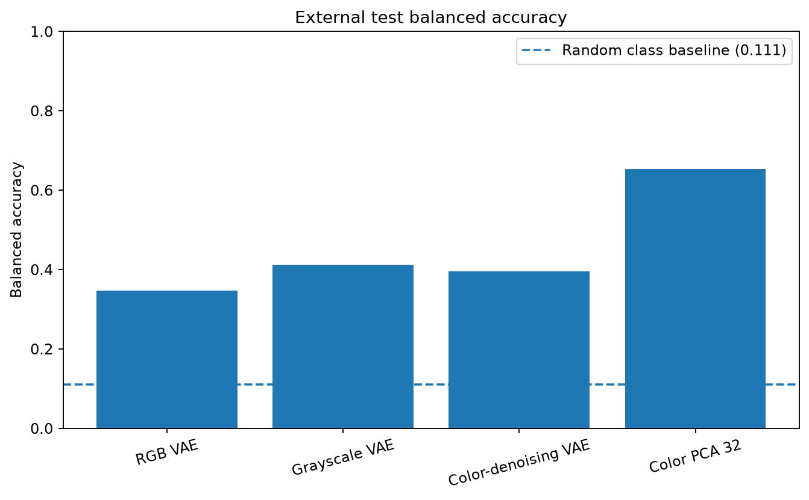
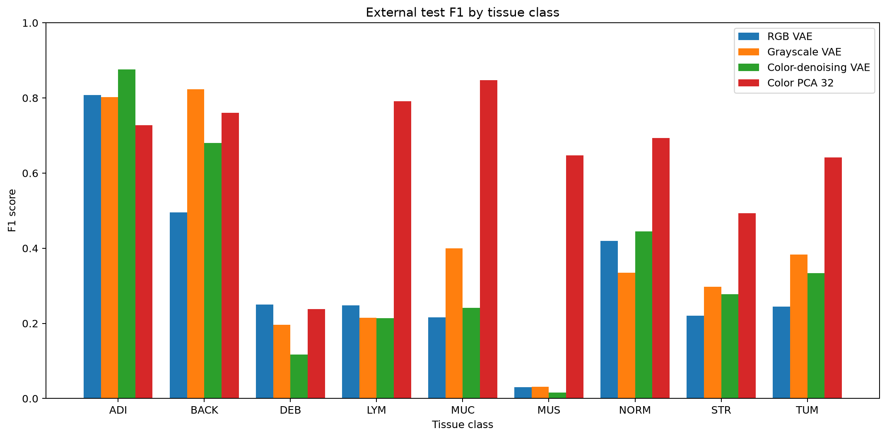
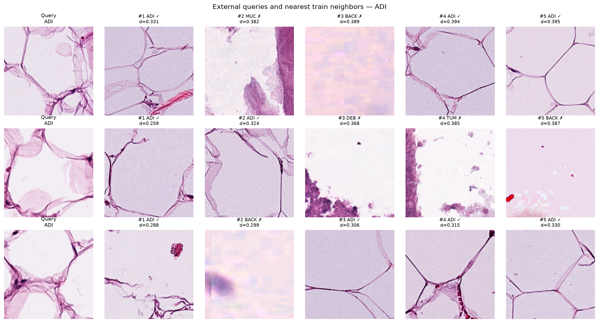
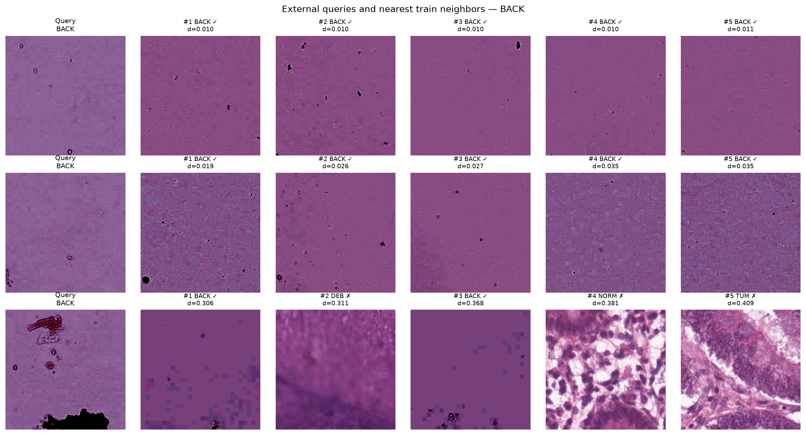

# Experimental Results

## Research question

Can a convolutional variational autoencoder learn transferable
morphological representations from public colorectal H&E image patches,
and how strongly are these representations affected by color shortcuts?

## Data protocol

The pilot experiment uses public colorectal histology patches from:

- NCT-CRC-HE-100K as the training pool;
- CRC-VAL-HE-7K as an external evaluation dataset.

Nine tissue classes are included:

| Code | Tissue class |
|---|---|
| ADI | Adipose tissue |
| BACK | Background |
| DEB | Debris |
| LYM | Lymphocytes |
| MUC | Mucus |
| MUS | Smooth muscle |
| NORM | Normal colon mucosa |
| STR | Cancer-associated stroma |
| TUM | Colorectal adenocarcinoma epithelium |

Pilot sample sizes:

| Split | Images | Images per class |
|---|---:|---:|
| Train | 4,860 | 540 |
| Validation | 540 | 60 |
| External test | 1,800 | 200 |

The internal train/validation split is patch-level because the public
training archive does not provide a reliable patch-to-patient mapping.
The external test dataset is separate from the training dataset.

Labels are not used during VAE training. They are used only for
post-hoc evaluation.

## Compared representations

Four 32-dimensional representations were evaluated:

1. RGB VAE;
2. grayscale VAE;
3. RGB color-denoising VAE;
4. 32-component PCA representation of 136 spatially invariant RGB/HSV
   color statistics.

The color-denoising VAE receives a color-jittered RGB image as input and
reconstructs the corresponding clean RGB target.

## External linear-probe results

A logistic-regression linear probe was trained on frozen features.
Regularization strength was selected on the validation split. The final
probe was refitted on train and validation and evaluated on the external
test set.

| Representation | Input dimensions | Probe dimensions | Balanced accuracy | Macro-F1 |
|---|---:|---:|---:|---:|
| RGB VAE | 32 | 32 | 0.3478 | 0.3256 |
| Color-denoising VAE | 32 | 32 | 0.3961 | 0.3555 |
| Grayscale VAE | 32 | 32 | **0.4122** | **0.3872** |
| RGB-HSV PCA | 136 | 32 | **0.6528** | **0.6490** |

The balanced random-class reference is approximately 0.1111.

## Interpretation of the linear probe

The spatially invariant color baseline substantially outperformed all
VAE representations. This indicates that the dataset contains a strong
color-related shortcut signal.

Among the learned VAE representations, grayscale preprocessing produced
the strongest balanced accuracy and macro-F1. Color-denoising also
improved performance relative to the standard RGB VAE.

These results suggest that unconstrained RGB reconstruction encourages
the baseline VAE to spend representational capacity on color variation
that is not consistently useful for transferable tissue representation.

## Paired bootstrap analysis

A paired stratified patch bootstrap with 2,000 iterations was used to
compare predictions on the same external test patches.

### Grayscale VAE versus RGB VAE

| Metric | Mean improvement | 95% bootstrap interval |
|---|---:|---:|
| Balanced accuracy | +0.0640 | +0.0428 to +0.0861 |
| Macro-F1 | +0.0619 | +0.0393 to +0.0849 |

The intervals are entirely above zero.

### Color-denoising VAE versus RGB VAE

| Metric | Mean improvement | 95% bootstrap interval |
|---|---:|---:|
| Balanced accuracy | +0.0488 | +0.0311 to +0.0667 |
| Macro-F1 | +0.0304 | +0.0110 to +0.0502 |

Color-denoising also consistently outperformed the standard RGB VAE.

### Grayscale versus color-denoising VAE

| Metric | Mean grayscale advantage | 95% bootstrap interval |
|---|---:|---:|
| Balanced accuracy | +0.0158 | -0.0039 to +0.0367 |
| Macro-F1 | +0.0314 | +0.0099 to +0.0534 |

The balanced-accuracy interval crosses zero, while the macro-F1 interval
does not. The two models therefore have comparable overall accuracy, but
grayscale preprocessing produces more balanced class-level performance.

The bootstrap is patch-level rather than patient-clustered because
reliable patient identifiers are unavailable for the training archive.

## Class-level observations

Notable observations:

- color-denoising VAE performs particularly well for adipose tissue;
- grayscale VAE performs strongly for background;
- debris remains difficult for every representation;
- the color baseline is strongest for lymphocytes, mucus, smooth muscle,
  normal mucosa, stroma and tumor epithelium;
- stroma remains challenging even for the color baseline.

The strong performance of global color statistics indicates that high
classification accuracy alone must not be interpreted as evidence of
morphological understanding.

## Nearest-neighbor retrieval

Nearest-neighbor retrieval was evaluated by searching the training
embeddings for each external test embedding. Labels were not used during
retrieval and were applied only for post-hoc scoring.

### Cosine retrieval

| Model | Top-1 | MRR | Precision@5 | Hit rate@5 |
|---|---:|---:|---:|---:|
| Grayscale VAE | **0.3539** | **0.4824** | 0.3313 | **0.7172** |
| Color-denoising VAE | 0.3494 | 0.4760 | **0.3352** | 0.6939 |

Both models are well above the balanced random reference of 0.1111.
Their overall retrieval performance is comparable.

Grayscale VAE provides slightly better top-1 retrieval and hit rate at
five. Color-denoising produces marginally higher average neighborhood
purity.

Cosine distance outperformed Euclidean distance for both models,
especially for normal and tumor epithelium.

## Retrieval examples

### Grayscale VAE — adipose tissue

### Grayscale VAE — debris

### Grayscale VAE — stroma

### Color-denoising VAE — background

### Color-denoising VAE — normal mucosa

### Color-denoising VAE — tumor epithelium

## Main conclusions

1. The public CRC patch datasets contain a strong color-related shortcut.
2. The baseline RGB VAE learns a non-random but relatively weak
   transferable tissue representation.
3. Removing color improves both balanced accuracy and macro-F1.
4. Color-denoising also improves over the standard RGB VAE.
5. Grayscale and color-denoising VAEs learn complementary tissue
   characteristics.
6. Latent spaces are best organized for visually simple classes such as
   adipose tissue and background.
7. Epithelial, stromal, muscular and inflammatory classes remain
   substantially mixed.
8. Cosine distance better matches the local geometry of the learned
   latent spaces than Euclidean distance.

## Limitations

- The experiment uses pilot subsets rather than the complete datasets.
- Internal validation is patch-level rather than patient-level.
- Bootstrap confidence intervals are patch-level.
- A single training seed was used for each main model.
- The VAE uses pixel-wise reconstruction and a relatively small
  convolutional architecture.
- Color jitter is not equivalent to dedicated H&E stain augmentation.
- Linear separability does not establish clinical utility or biological
  causality.
- No downstream patient outcome or treatment task is evaluated.
- No proprietary or patient-confidential data is used.

## Future work

Possible extensions include:

- repeated training with multiple random seeds;
- dedicated H&E stain augmentation;
- latent consistency between clean and color-augmented views;
- a pretrained histology or self-supervised encoder baseline;
- patient-level evaluation when reliable patient identifiers are
  available;
- evaluation on additional institutions and scanners.